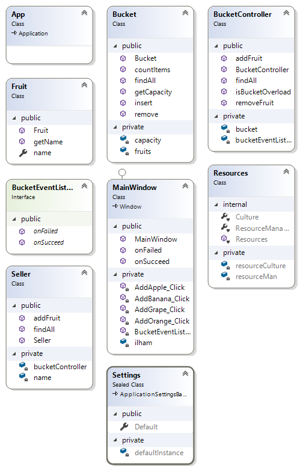

# Fresh Fruit App
Aplikasi sederhana tentang penjualan buah yang menerapkan konsep MVC yang ditekankan agar mahasiswa paham konsep View

## Scope and Functionalities
* User dapat mengklik tombol
* User dapat melihat gambar
* User dapat melihat warning
* User dapat melihat perubahan pada tampilan aplikasi

## How Does it works?
1. Apa fungsi `BucketEventListener`? <br>
    Sebagai tempat untuk handle event ketika action dijalankan berhasil (onSucceed) atau gagal (onFailed)
2. Class Diagram <br>

3. Logika pemrogramannya. <br>

Diawali pada `MainWindow.xaml.cs`, dengan membuat sebuah instance dari masing - masing class.
```csharp
        Seller ilham;
        public MainWindow()
        {
            InitializeComponent();

            Bucket cartFruit = new Bucket(2);
            BucketController bucketController = new BucketController(cartFruit, this);

            ilham = new Seller("Ilham Syah", bucketController);
            ListBoxBucket.ItemsSource = cartFruit.findAll();
        }
```

Pada bari pertama digunakan untuk membuat instance `Seller` dengan nama ilham, lalu diikuti dengan membuat instance
`Bucket` dengan cartFruit dan `BucketController` dengan nama bucketController dan memberikan argumen cartFruit dan context `this`.

lalu mendeklarasikan dari instance `Seller` yang telah dibuat tadi, dengan memberikan argument "Ilham Syah" dan bucketController. Setelah itu memasukkan semua item dari
cartFruit ke listbox

```csharp
        private void AddApple_Click(object sender, RoutedEventArgs e)
        {
            Fruit apple = new Fruit("Apple");
            ilham.addFruit(apple);
        }
```
Lalu dalam function AddApple_Click, digunakan untuk menambahkan item Apple pada cart nya. Ini berlaku
juga untuk AddBanana_Click, AddOrange_Click, dll

```csharp
        public void onFailed (string msg)
        {
            MessageBox.Show(msg, "Warning");
        }

        public void onSucceed (string msg)
        {
            ListBoxBucket.Items.Refresh();
        }
```
Lalu kode diatas digunakan ketika failed maka akan ditampilkan sebuah popup warning dan jika berhasil akan mengupdate ata merefresh listBoxnya

<br></br>
Lalu masuk ke `model/Seller.cs`, digunakan sebagai model atau kerangka atau seller. Dalam class ini terdapat
instance dari `BucketController`

```csharp
        public List<Fruit> findAll ()
        {
            return this.bucketController.findAll();
        }

        public void addFruit (Fruit fruit)
        {
            this.bucketController.addFruit(fruit);
        }
```
Selain itu ada function `findAll ()` yang digunakan untuk mengambil data dari `bucketController`. Sedangkan
`addFruit ()` digunakan untuk menambah data ke `bucketController`

```csharp
        public string name { get; set; }
        
        public Fruit(string name)
        {
            this.name = name;
        }

        public string getName ()
        {
            return this.name;
        }
```
Pada `model/Fruit.cs` hanya terdapat kerangka untuk fruit saja, terdapat getter dan setter untuk nama.

```csharp
        private int capacity;
        private List<Fruit> fruits;

        public Bucket (int capacity)
        {
            this.capacity = capacity;
            this.fruits = new List<Fruit>();
        }

        public void insert (Fruit fruit)
        {
            this.fruits.Add(fruit);
        }

        public void remove (int pos)
        {
            this.fruits.RemoveAt(pos);
        }

        public List<Fruit> findAll ()
        {
            return this.fruits;
        }

        public int getCapacity ()
        {
            return this.capacity;
        }

        public int countItems ()
        {
            return this.fruits.Count();
        }
```
Pada `model/Bucket.cs` terdapat method yang fungsinya bermacam - macam sesuai nama fungsinya. Terdapat juga list untuk menampung data
yang telah ditambahkan

```csharp
        void onSucceed(string msg);
        void onFailed(string msg);
```
Pada `model/BucketEvenListener` hanya terdapat dua function untuk menghandle event onSucceed dan onFailed

```csharp
        public void addFruit (Fruit fruit)
        {
            if (isBucketOverload())
            {
                bucketEventListener.onFailed("opps keranjang sudah penuh gan!");
            } else
            {
                this.bucket.insert(fruit);
                bucketEventListener.onSucceed("yeeayy buah berhasil ditambahkan!");
            }
        }
```
Pada `controller/BucketController.cs` terdapat function addFruit yang berguna untuk menambah data pada list. Namun
bucket dicek terlebih dahulu apakah overload atau tidak

```csharp
        public bool isBucketOverload ()
        {
            return bucket.countItems() >= bucket.getCapacity();
        }
```
Kode diatas digunakan untuk mengecek apakah bucket overload atau tidak

```csharp
        public void removeFruit (Fruit fruit)
        {
            for (int itemPos = 0; itemPos < bucket.countItems(); itemPos++)
            {
                if (bucket.findAll ().ElementAt(itemPos).getName() == fruit.name)
                {
                    bucket.remove(itemPos);
                    bucketEventListener.onSucceed("yeayyy berhasil dihapus");
                }
            }
        }
```
Sedangkan kode diatas untuk menghapus item pada list, namun function ini blm diimplementasikan dalam aplikasi ini